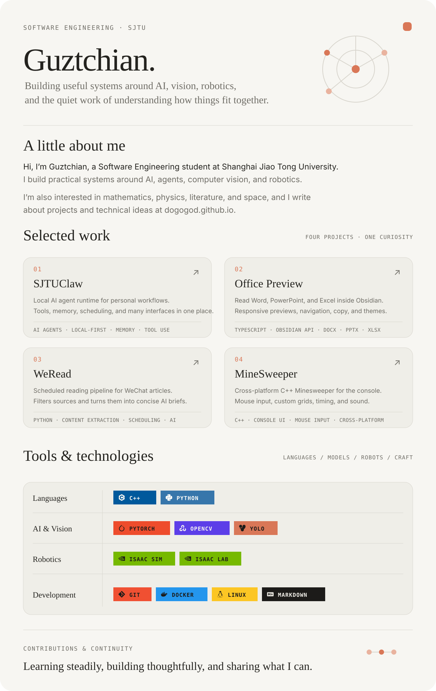

  <picture>
    <source media="(prefers-color-scheme: dark)" srcset="./assets/readme/profile-page-dark.svg">
    <source media="(prefers-color-scheme: light)" srcset="./assets/readme/profile-page-light.svg">
    
  </picture>

  <a href="https://dogogod.github.io">Personal site</a>&nbsp;&nbsp;·&nbsp;&nbsp;
  <a href="https://github.com/DOGOGOD/SJTUClaw">SJTUClaw</a>&nbsp;&nbsp;·&nbsp;&nbsp;
  <a href="https://github.com/DOGOGOD/Office-Preview">Office Preview</a>&nbsp;&nbsp;·&nbsp;&nbsp;
  <a href="https://github.com/DOGOGOD/WeRead">WeRead</a>&nbsp;&nbsp;·&nbsp;&nbsp;
  <a href="https://github.com/DOGOGOD/MineSweeper">MineSweeper</a>

