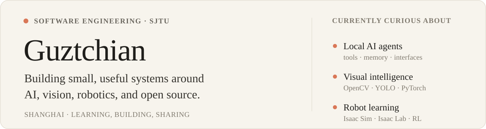

  <picture>
    <source media="(prefers-color-scheme: dark)" srcset="./assets/readme/profile-header-dark.svg">
    <source media="(prefers-color-scheme: light)" srcset="./assets/readme/profile-header-light.svg">
    
  </picture>

## A little about me

I'm a Software Engineering student at **Shanghai Jiao Tong University**. I'm interested in how intelligent systems see, reason, and interact with the world, and I enjoy turning those ideas into small tools that people can actually use.

Right now, I'm learning more about **AI agents**, **reinforcement learning**, and **embodied intelligence**, supported by a foundation in Mathematical Analysis, Linear Algebra, Discrete Mathematics, Probability, and Statistics.

## Selected work

- **[SJTUClaw](https://github.com/DOGOGOD/SJTUClaw)** — a local AI agent runtime with tool calling, memory, scheduled tasks, and multiple interfaces.
- **[Office Preview](https://github.com/DOGOGOD/Office-Preview)** — preview Word, PowerPoint, and Excel files directly inside Obsidian.
- **[WeRead](https://github.com/DOGOGOD/WeRead)** — collect subscribed WeChat articles and turn them into personalized AI reading briefs.
- **[MineSweeper](https://github.com/DOGOGOD/MineSweeper)** — a cross-platform C++ console Minesweeper with mouse input and colorful rendering.

## Tools I use

  <picture>
    <source media="(prefers-color-scheme: dark)" srcset="https://skillicons.dev/icons?i=cpp,py,ts,pytorch,opencv,git,docker,linux&theme=dark&perline=8">
    <source media="(prefers-color-scheme: light)" srcset="https://skillicons.dev/icons?i=cpp,py,ts,pytorch,opencv,git,docker,linux&theme=light&perline=8">
    
  </picture>

  Also working with YOLO, Isaac Sim, Isaac Lab, reinforcement learning, and local AI agent systems.

## Contributions

<picture>
  <source media="(prefers-color-scheme: dark)" srcset="https://raw.githubusercontent.com/DOGOGOD/DOGOGOD/output/github-contribution-grid-snake-dark.svg">
  <source media="(prefers-color-scheme: light)" srcset="https://raw.githubusercontent.com/DOGOGOD/DOGOGOD/output/github-contribution-grid-snake.svg">
  
</picture>

  <i>Learning steadily, building thoughtfully, and sharing what I can.</i> 🌱

